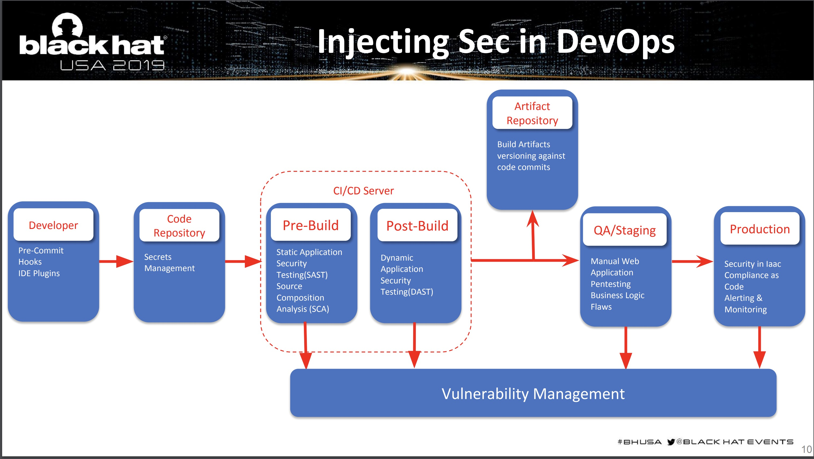
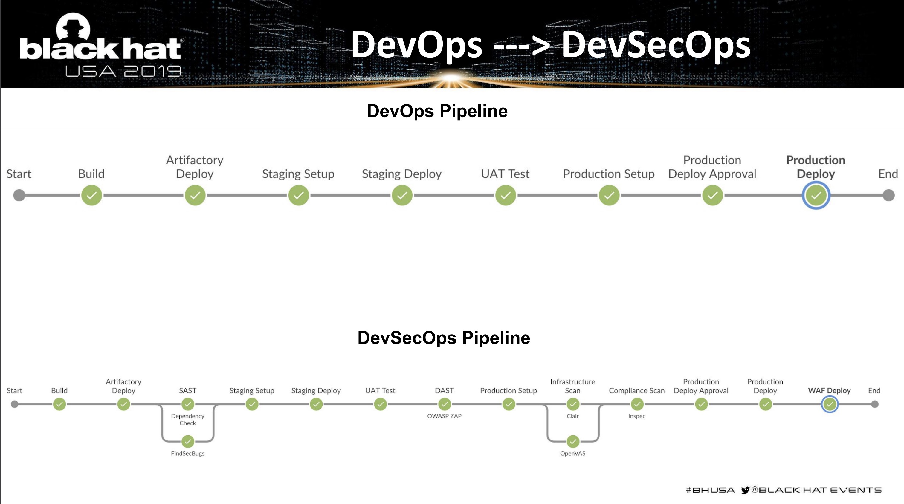

# DevSecOps

Este archivo tiene los apuntes de la investigación en el area DevSecOps





### Devops VS DevSecOps Pipeline




# Herramientas

## Threat Model Analysis
* [Threat Playbook Framework](https://we45.gitbook.io/threatplaybook/)
* [Threat Spec](https://threatspec.org/)
* [MS Thret Modeling Tool](https://docs.microsoft.com/en-us/azure/security/develop/threat-modeling-tool)

## Pre Commit Hooks
* [Git Secret](https://git-secret.io/)
* [Truffle Hog](https://trufflesecurity.com/trufflehog)
* [Git Hound](https://github.com/ezekg/git-hound)

## Software Composition Analysis
* [OWASP Dependency Check](https://owasp.org/www-project-dependency-check/)
* [Requires IO](https://requires.io/)
* [Retire.js](https://retirejs.github.io/retire.js/)

## Static Analysis Security Testing (SAST)
* [Bandit-Python](https://pypi.org/project/bandit/)
* [Breakman-Ruby](https://brakemanscanner.org/)
* [RIPS](https://www.ripstech.com/)
* [Sonarqube](https://www.sonarqube.org/)
* [PMD](https://pmd.github.io/)

## IDE Plugins

* [Sonar Lint](https://www.sonarlint.org/)
* IntelliJ Idea
* VS Code
    * [Microsoft DevSkim](https://marketplace.visualstudio.com/items?itemName=MS-CST-E.MicrosoftDevSkim)
    * [Microsoft Code Analysis Tool .NET (CAT.NET)](https://www.microsoft.com/en-us/download/details.aspx?id=19968)

* Eclipse

## Secret Management 
* [Hashicorp Vault](https://www.vaultproject.io/)
* [KeyWhiz](https://square.github.io/keywhiz/)
* [Confidant](https://lyft.github.io/confidant/)

## Vulnerability Management

* [Archery](https://www.archerysec.com/)
* [Jack Hammer](https://github.com/olacabs/jackhammer)
* [Defect Dojo](https://www.defectdojo.org/)

## Dynamic analysis Security Testing (DAST)

* [Zap Proxy](https://www.zaproxy.org/)
* [Arachny](https://www.arachni-scanner.com/)
* [W3AF](https://w3af.org/)
* [Wapiti](https://wapiti.sourceforge.io/)

## Security In Infrastructure as Code

* [OpenVAS](https://openvas.org/)
* [Anchore - Container Devsec](https://anchore.com/)
* [Clair](https://github.com/quay/clair)
* [Dockscan](https://github.com/kost/dockscan)
* [OpenScap](https://www.open-scap.org/)

## Compliance as Code

* [Kitchen CI](https://kitchen.ci/)
* [Chef Inspec](https://docs.chef.io/inspec)
* [DevSec Hardenng Framework](https://dev-sec.io/)
* [Docker Bench for Security](https://github.com/docker/docker-bench-security)

## WAF Web Application Framework
* [ModSecurity](https://www.modsecurity.org/)
* [Naxsi Nginx WAF](https://github.com/nbs-system/naxsi)


* Git
* JUnit
* Pre Commit Hooks
* Maven
* Zap Proxy
*
* Findbugs
* PMD
* IDE Plugins.(Sonar Lint)
* Chef Inspec (Compliance as code)
* Jenkins
* Bitbucket Pipelines
* Linux
* Wireshark

## Infraestructura como código
---------------------------

* Terraform
* Ansible
* Chef
* Chef Inspec
* Puppet
* Saltstack


### Ansible
 * Curso Udemy de Ansible.

### Terraform
* [Proveedor Bitbucket para terraform, permite crear repositorios](https://www.terraform.io/docs/providers/bitbucket/index.html)


## Jenkins

* [Jenkins Docker](https://github.com/jenkinsci/docker/blob/master/README.md)


## Seguridad
----

* [Zap Proxy](https://www.zaproxy.org/)
* dotdotpwn: Fuzzing para buscar acceso a directorios fuera del CGI Home

## Zap Proxy
---


* [Video All Day Devops Zap in ten ](https://www.alldaydevops.com/zap-in-ten)

### Análisis Zap Proxy


* [Path Traversal](http://projects.webappsec.org/Path-Traversal)
* [Path Traversal 2](http://cwe.mitre.org/data/definitions/22.html)


## OWASP
----

## Oracle Blog - Implement NIST Security
----
https://blogs.oracle.com/cloudsecurity/leveraging-the-nist-cybersecurity-framework-for-devsecops

### Threat Model Playbook
----

* [Threat Playbook](https://we45.gitbook.io/threatplaybook/)


### WebGoat

Aplicación Java Web vulnerable para pruebas de seguridad. 

* [Aplicacion Web Vulnerable](https://github.com/WebGoat/WebGoat)


```
curl https://raw.githubusercontent.com/WebGoat/WebGoat/develop/docker-compose.yml | docker-compose -f - up
```

* http://localhost:8080/WebGoat
* http://10.252.226.114:8080/WebGoat


```
dotdotpwn -m http -h 10.252.226.114
```

## Videos
---

* Web application security: 10 things developers need to know   
https://youtu.be/qjrkV4RjgIU


## Glosario
---
* DAST: Dynamic Application Security Testing
* SAST: Static Application Security Testing

