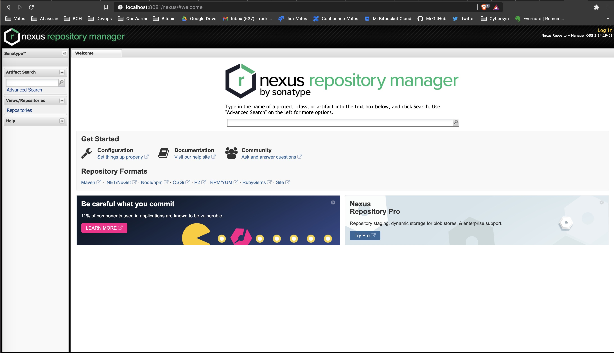

# Instalación Nexus en Docker
----

* [Nexus Docker](https://blog.sonatype.com/sonatype-nexus-installation-using-docker)

```
docker pull store/sonatype/nexus:2.13.0-01
docker pull sonatype/nexus
Using default tag: latest
latest: Pulling from sonatype/nexus
1323a241cc06: Downloading [=>                                                 ]  1.619MB/76.39MB
2bd25ca12457: Download complete 
404104cef950: Downloading [>                                                  ]   1.07MB/56.34MB
084e4de034f2: Downloading [>                                                  ]   1.07MB/83.62MB
96beb915a3b7: Waiting 
```

## Crear Volumen y ejecutar contenedor

````
docker volume create –name nexus-data
docker run -d -p 8081:8081 -p 8083:8083 -v nexus-data:/nexus-data sonatype/nexus:oss
Unable to find image 'sonatype/nexus:oss' locally
oss: Pulling from sonatype/nexus
Digest: sha256:fbe13620b3604be6c471a4841eba0a1b7b648eb89c0a3a9470ebfc31159f6755
Status: Downloaded newer image for sonatype/nexus:oss
84ff4ffb62dacc6f52f87b7c8ffc1c3c5351981797f85bb4937082a4aab5b157
 rvaldes@MBP-de-Rodrigo  ~  docker ps
CONTAINER ID        IMAGE                COMMAND                  CREATED             STATUS              PORTS                                            NAMES
84ff4ffb62da        sonatype/nexus:oss   "/bin/sh -c 'java   …"   4 seconds ago       Up 4 seconds        0.0.0.0:8081->8081/tcp, 0.0.0.0:8083->8083/tcp   cool_buck
````

## Nexus Instalado via Docker con Volumenes persistentes 




