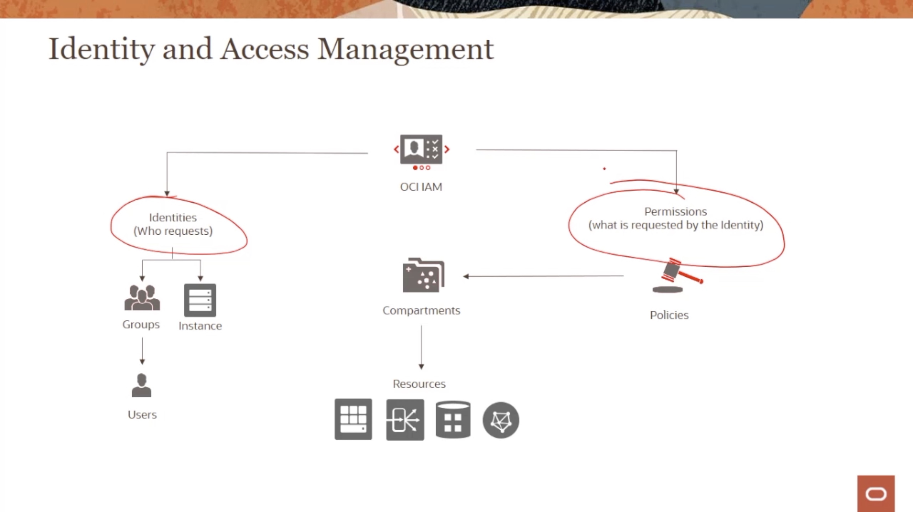

# OCI Foundations

## 2: Core OCI Services

* OCI Compute Services
* OCI Storage Serivices
* OCI Network Services
* OCI IAM

## OCI Identity and Access Management IAM

## Principals

Entidad que puede interactuar con recursos OCI.

* IAM users
* Instance Principals

### IAM Users and Groups

* Users: Usuarios individuales o aplicaciones.
* Primer usuario IAM = default administrator; configura otros usuarios y grupos.

* Los usuarios aplican el principio de seguridad del menor privilegio.

      1.- Usuario - > Grupo
      2.- Grupo -> Al menos una politica de permisos que en el tenancy o el comaprtiment.

### Instance Principals

Permite hacer llamadas API entre instancias y servicios OCI sin la necesidad de almacenar credenciales para comunicar entre servicios. 

## Compartment 

Conjunto de recursos relacionados.permite aislar y controlar el acceso a los recursos.

* Cada recurso pertenece sólo a un "Compartment"
* Los recursos de distintos Compartments, pueden interactuar.
* Se le puede dar acceso a los grupos a los "Compartments" partir de "Policies".

## Tenancy /Root Compartments

Existe un "Compartment" raiz, la buena practica indica que hay que aislar los recursos en distintos "Compartments".

## Workflow de agregar usuarios

Paso 1: Agregar a los usuarios a un Grupo Ejm: rvaldes al grupo "Network Admin Group".

Paso 2: Escribir una "policie"

## Authentication and Authorization

Responde ¿Quén es esta persona?. ¿Es quién dice que és?.

## Referencias

* [Curso OCI Foundations](https://learn.oracle.com/ols/course/oracle-cloud-infrastructure-foundations/35644/75250/102977)